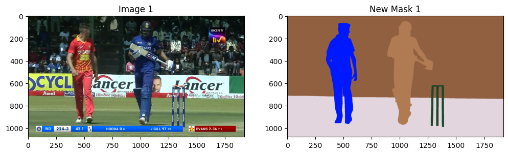
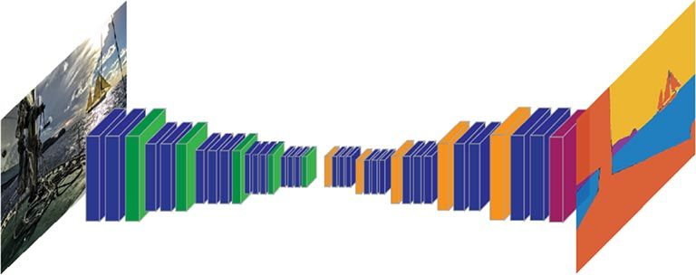
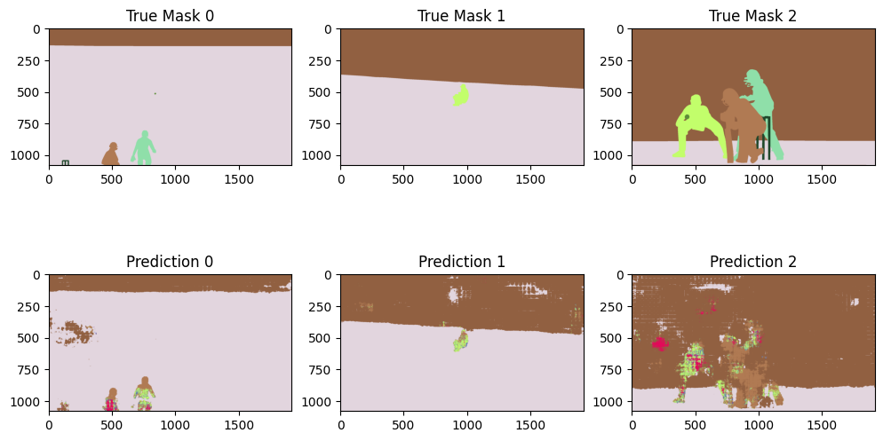
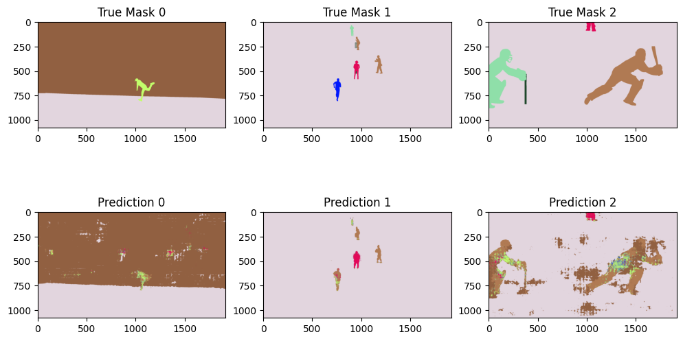

## Semantic Segmentation
This project demonstrates the use of a pretrained ResNet50 model for semantic image segmentation. 
The goal is to identify and separate different objects or regions within an image by applying a segmentation model.

---

### Dataset

The dataset consis of real images and their respective ground truth masks. 
Each image can be segmented into at most 9 different regions

**Example image**

---

### Architecture 
It utilizes a **ResNet50** model **pre-trained on ImageNet** and fine-tuned for semantic segmentation using a **U-net**. 

The model is tested on a dataset of images, and segmentation masks are predicted to classify different regions of the images.

---
### Results

Please refer to report.pdf for detailed results and analysis

Some sample **model predictions**

 

---

